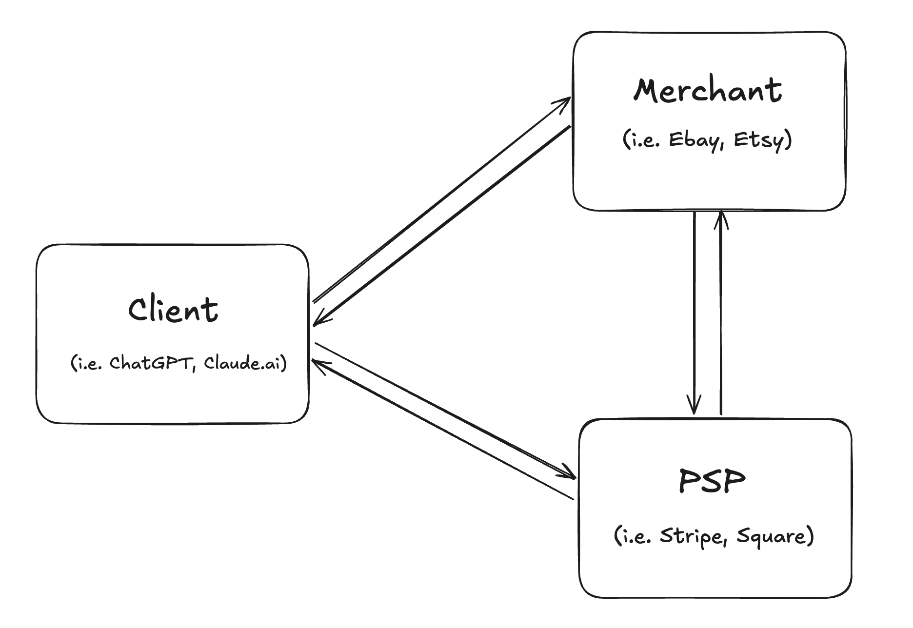

# Agentic Commerce Protocol (ACP) Demo Implementation
<p align="center">
  <a href="https://wzrd.tech">
    
  </a><br/>
  <em>Built with ❤️ by <a href="https://wzrd.tech">WZRD.tech</a></em>
</p>


On [September 29th](https://openai.com/index/buy-it-in-chatgpt/), OpenAI released the Agentic Commerce Protocol (ACP), which will be foundational for how agents transact with the outside world.  

ACP is already in use by Stripe, Shopify, and OpenAI. As an open-source standard, it isn’t limited to ChatGPT — it’s designed to let any LLM client transact with any vendor. This creates a *huge* opportunity for devs to start building on top of it today.  

To accelerate experimentation, we built the **first working mock implementation**: a sandbox that demonstrates the ACP flow end-to-end with a Client, Merchant, and Payment Service Provider (PSP).


## Quick Start

### Prerequisites

- Node.js 20+
- Docker & Docker Compose
- OpenAI and/or Anthropic API keys

### Setup

1. **Clone the repository**
   ```bash
   git clone https://github.com/wzrd-tech/agentic-commerce-protocol-demo
   cd agentic-commerce-protocol-demo
   ```

2. **Install dependencies**
   ```bash
   npm install
   ```
   This installs all dependencies across all workspaces (demo services + chat client).

3. **Configure API keys for the chat client**
   ```bash
   cd chat-client
   cp .env.example .env
   # Edit .env and add your OPENAI_API_KEY and/or ANTHROPIC_API_KEY
   cd ..
   ```

4. **Start all services**
   ```bash
   npm run dev
   ```
   This will:
   - Start PostgreSQL databases (via Docker)
   - Start the Merchant API (port 4001)
   - Start the PSP API (port 4000)
   - Start the MCP server (port 3112)

5. **Start the chat client** (in a new terminal)
   ```bash
   cd chat-client
   npm run dev
   ```
   Open http://localhost:3000 in your browser.

6. **Try it out!**
   - Ask the agent: "Show me some shirts"
   - Add items to cart
   - Complete checkout with test payment info
   - Examine how the Client, Merchant, and PSP interact via terminal

## Repository Structure

```
├── demo/              # Reference implementation of ACP
│   ├── mcp-ui-server/ # MCP server with commerce tools
│   ├── merchant/      # Merchant API (checkout sessions)
│   └── psp/           # Payment Service Provider
├── chat-client/       # MCP-UI compatible chat interface
│                      # (adapted from scira-mcp-ui-chat)
└── examples/          # Production-ready reference implementations
    └── reference-implementations/
        └── fal-ai-mcp-server/  # Full ACP compliance demo
```

## Featured Reference Implementation

### **Fal AI MCP Server** - Production-Ready Multi-Model Implementation

In addition to our commerce demo, we've built a **comprehensive reference implementation** that showcases full ACP protocol compliance with real-world AI model integration.

**[📂 View Implementation](./examples/reference-implementations/fal-ai-mcp-server/)**

#### Key Features

- ✅ **794+ AI Models** - Complete integration with Fal AI's model catalog
- ✅ **Full ACP Protocol** - Complete x402 compliance with all required headers
- ✅ **Production Ready** - Enterprise-grade error handling, logging, and monitoring
- ✅ **Idempotency** - 24-hour cache with conflict detection per ACP spec
- ✅ **Type Safety** - Complete TypeScript implementation
- ✅ **Well Tested** - Comprehensive test suite with >80% coverage

#### What You'll Learn

This reference implementation demonstrates:
- **ACP Header Management** - API-Version: 2025-09-29, Request-Id, Idempotency-Key
- **Flat Error Format** - ACP-compliant error responses (no nested envelopes)
- **Retry Logic** - Exponential backoff with proper error handling
- **Resource Discovery** - MCP resources for model catalog and schemas
- **Dynamic Tool Registration** - 794 models registered as callable tools
- **Caching Strategies** - Multi-layer caching (idempotency, schemas)
- **Production Logging** - Winston-based structured logging

#### Quick Start

```bash
cd examples/reference-implementations/fal-ai-mcp-server
npm install
cp .env.example .env
# Add your FAL_KEY to .env
npm run build

# Get path for Claude Desktop
npm run get-path
```

Then add to your Claude Desktop config:
```json
{
  "mcpServers": {
    "fal-ai": {
      "command": "node",
      "args": ["/path/to/fal-ai-mcp-server/build/index.js"],
      "env": {
        "FAL_KEY": "your-fal-api-key"
      }
    }
  }
}
```

**[📚 Full Setup Guide](./examples/reference-implementations/fal-ai-mcp-server/SETUP_GUIDE.md)**

---

# Core Concepts & Definitions

ACP coordinates three modular systems:

- **Client**: The environment where users interact with an LLM (e.g., ChatGPT, Claude.ai, Ollama).
- **Merchant**: A vendor (e.g., Etsy, eBay, Amazon) selling goods or services through the client.  
- **Payment Service Provider (PSP)**: Processes payments on behalf of the merchant (e.g., Stripe, Square). *Most merchants outsource this role to avoid PCI compliance scope.*
    

<br/>
<p align="center">

</p>

## Implementation Details

### Client

-   For ease of development, server logic is offshored onto an MCP server compatible with [MCP-UI](https://github.com/idosal/mcp-ui): an open-source extension of MCP that introduces UI components as tool return types.
- For our chat client, we adapted [Ido Saloman's MCP-UI-compatible fork of Scira Chat](https://github.com/idosal/scira-mcp-ui-chat) (see `chat-client/` directory)
-   In our implementation, the chat client + MCP together constitute the Client entity in the ACP protocol.

### Merchant + PSP
-   Each service implements the endpoints required by the ACP spec.
    -   **Merchant**: checkout session management.
    -   **PSP**: delegated payment endpoint for minting tokens.

## Shopping Workflow

*See [OpenAI's docs](https://developers.openai.com/commerce/specs/checkout)*

##### Open a checkout session

When the user first adds an item to the cart, the Client calls:
```http
POST /checkout_sessions
```
-   The request body includes the line items being added.
-   A checkout session state tracks line items, user contact info, and fulfillment address.
    

##### Update session state

As the user shops, the Client updates the Merchant each time the cart, contact info, or fulfillment address changes:
```http
POST /checkout_sessions/{checkout_session_id}
```
-   Per ACP spec, the Merchant returns its copy of the updated checkout state.
-   The Client treats this as the source of truth and updates the in-chat UI accordingly.

##### Cancel session (optional)
Removing all items from the cart cancels the session. Alternatively, the Client can explicitly cancel by calling:
```http
POST /checkout_sessions/{checkout_session_id}/cancel
```

##### Retrieve session details (optional)
For implementations that need it, the Client can fetch details for a session:
```http
GET /checkout_sessions/{checkout_session_id}
```


## Payment / Checkout Workflow
*See [OpenAI's docs](https://developers.openai.com/commerce/specs/payment)*

For transactions, we implemented the Delegated Checkout flow:
1.  When the user submits payment credentials, the Client passes them to the Merchant’s PSP.
2.  The PSP stores the credentials and mints a Shared Payment Token (a reference to the vaulted credentials).
3.  The PSP returns the token to the Client.
4.  The Client POSTs `/checkout_sessions/:checkout_session_id/complete` to the Merchant, including the token.
5.  The Merchant redeems the token with the PSP, which invalidates it and executes the transaction.
    

##### Why delegated payments?
-   Merchants don’t want to handle raw card data (which would put them in PCI compliance scope).
-   Delegating to a PSP is industry-standard — ACP formalizes this so that agents can pay programmatically instead of relying on web redirects or brittle RPA flows.
    

## Product Feed
*See [OpenAI's docs](https://developers.openai.com/commerce/specs/feed)*
-   ACP also defines a spec: merchants must regularly provide product data (TSV, CSV, XML, JSON) to a secure endpoint.
-   For demo purposes, our Client simply calls the Merchant’s `GET /products` once on startup and ingests results into a lightweight vector store for lookup.
    
## The Future
All endpoints defined by the ACP spec adhere to the standard, including required headers, response formats, and idempotency handling. 

That said, [ACP repo](https://github.com/agentic-commerce-protocol/agentic-commerce-protocol) is still in `draft`, so details may change. We’ll track updates closely and welcome contributions from the community to keep this implementation in sync!

## About Us
WZRD.tech is building cutting-edge agentic infrastructure and MCP implementations for the AI economy. Learn more about our work at [wzrd.tech](https://wzrd.tech).

</br>

---
*Note: This repo is a demo sandbox. All transactions are mocked — no real payments occur.*